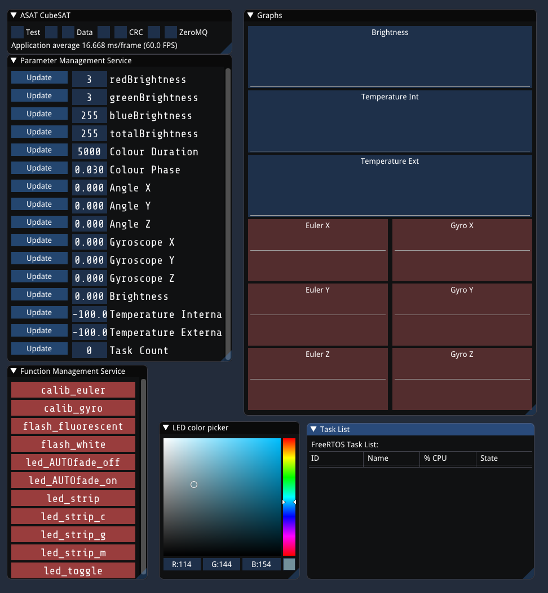

# Mock-Up Support code
The code for the supporting hardware & software of the CubeSat mockup can be found here.

## Directories
- **Cubesat_Turntable_Motor**: Arduino code for the display turntable motor controller
- **ReceiverArduino**: Arduino code for the ground station
- **SerialHandler**: C++ program that processes serial data from the ground station
- **UnityModel**: Unity C# project for the live 3D satellite model
